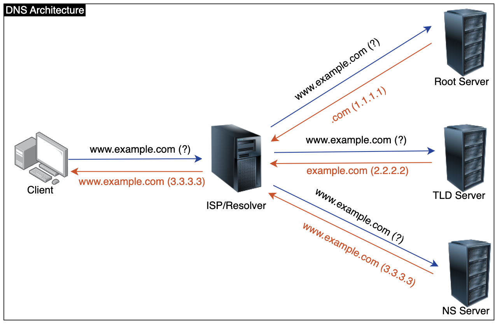

[![LinkedIn][linkedin-shield-lapissoft]][linkedin-url-lapissoft]
[![Facebook-Page][facebook-shield-lapissoft]][facebook-url-lapissoft]
[![Youtube][youtube-shield-lapissoft]][youtube-url-lapissoft]

## Visit Us [Lapis Soft](http://www.lapissoft.com)

### Domain Name System (DNS) 
It is a decentralized hierarchical naming system that is used to translate human-readable domain names (like www.example.com) into numerical IP addresses (like 192.0.2.1) that computers can understand.

 ### DNS Components & Explanation
1. DNS Client
   - Who are request DNS queries 
  
2. DNS Resolver (ISP)
   - Receive queries & return respective IP 

3. Root Server
   - Top level of DNS hierarchy. Its responsible for providing location of TLD

4. Top Level Domain
   - Contains TLD info (.com, .net, .org etc.)

5. Authoritative Name Servers
   These servers store and provide authoritative DNS records for specific domain names. Every domain name has one or more authoritative name servers that are designated by the domain owner or registrar. These servers store DNS records such as 
   - A Record: Maps a domain name to an IPv4 address.
   - AAAA Record: Maps a domain name to an IPv6 address.
   - CNAME Record: Maps an alias (canonical name) to another domain name.
   - MX Record: Specifies the mail exchange servers for a domain.
   - TXT Record: Holds text information associated with the domain.
   - NS Record: Specifies the authoritative name servers for a domain.

6. Resource Records (RR)
   Information about each domain services (Web, Mail, SMTP etc.) stored the NS called Resource Records.

7. Caching 
   The resolver caches the IP address and associated information obtained from the authoritative name servers for a certain amount of time (called the TTL, or Time to Live). This helps to speed up future queries for the same domain and reduces the load on DNS servers.

8. Primary/Master DNS Server
   It is an authoritative server. The master database of a domain information is stored here and Resource Records (RR) are entered/added in this database from this server.

9.  Secondary/Slave DNS Server
    It also is an authoritative server. The replica (slave) database of a domains information is stored here. No Resource Records (RR) entries are given in this server, it is polled from the master/primary server. 

***DNS Architecture***

```bash
ip addr
```
```bash
apt install bind9
```
```bash
named -v
```
```bash
hostnamectl status
```

## Courtesy of Jakir

[![LinkedIn][linkedin-shield-jakir]][linkedin-url-jakir]
[![Facebook-Page][facebook-shield-jakir]][facebook-url-jakir]
[![Youtube][youtube-shield-jakir]][youtube-url-jakir]

### Have a good day, stay with me
<!-- Personal profile -->

[linkedin-shield-jakir]: https://img.shields.io/badge/linkedin-%230077B5.svg?style=for-the-badge&logo=linkedin&logoColor=white
[linkedin-url-jakir]: https://www.linkedin.com/in/jakir-ruet/
[facebook-shield-jakir]: https://img.shields.io/badge/Facebook-%231877F2.svg?style=for-the-badge&logo=Facebook&logoColor=white
[facebook-url-jakir]: https://www.facebook.com/jakir-ruet/
[youtube-shield-jakir]: https://img.shields.io/badge/YouTube-%23FF0000.svg?style=for-the-badge&logo=YouTube&logoColor=white
[youtube-url-jakir]: https://www.youtube.com/@mjakaria-ruet/featured

<!-- Company profile -->

[linkedin-shield-lapissoft]: https://img.shields.io/badge/linkedin-%230077B5.svg?style=for-the-badge&logo=linkedin&logoColor=white
[linkedin-url-lapissoft]: https://www.linkedin.com/company/lapis-soft/
[facebook-shield-lapissoft]: https://img.shields.io/badge/Facebook-%231877F2.svg?style=for-the-badge&logo=Facebook&logoColor=white
[facebook-url-lapissoft]: https://www.facebook.com/GoLapisSoft/
[youtube-shield-lapissoft]: https://img.shields.io/badge/YouTube-%23FF0000.svg?style=for-the-badge&logo=YouTube&logoColor=white
[youtube-url-lapissoft]: https://www.youtube.com/@LapisSoft/featured
